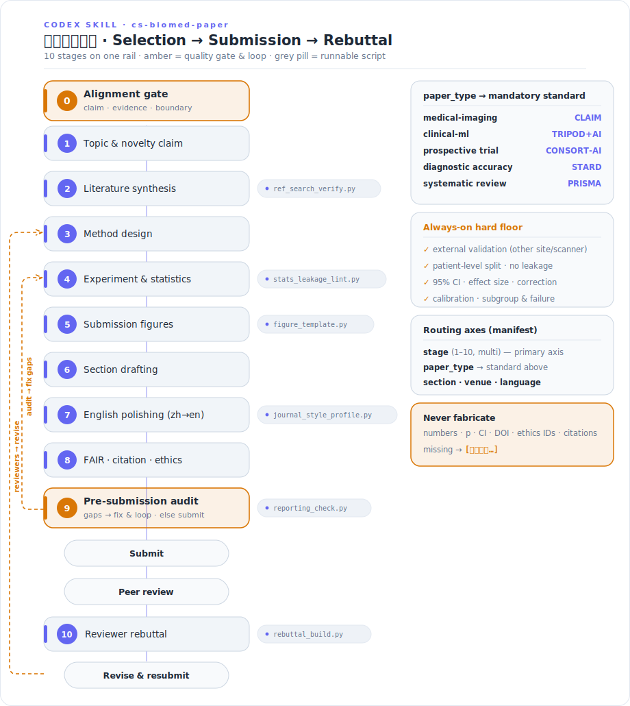

# `cs-biomed-paper` 技能

<p align="center">
  
</p>

面向**计算机 × 生物医学交叉方向**的 SCI 论文写作全流程技能：覆盖从选题、文献、方法、实验统计、
投稿级图表、分章写作、英文润色、引用与数据/代码可用性（FAIR）、拒稿风险自查，到逐点审稿回复
（rebuttal）的完整闭环。典型场景：医学影像分析、临床机器学习、生物信号/可穿戴、生物信息/组学、
方法-基准类工作。

技能默认支持中文作者笔记（`zh-to-en`），产出可直接使用的英文稿件、图表文件、`.bib`/`.ris`、报告
规范核查报告与回复信骨架。

## 它和「纯 CS 写作」「纯医学写作」有何不同（硬约束内置）

- **报告规范按论文类型强制挂载**：医学影像→CLAIM、临床预测模型→TRIPOD+AI、前瞻性 AI 试验→
  CONSORT-AI、诊断准确性→STARD、系统综述→PRISMA（来源见 `references/reporting-standards/`）。
- **临床/生物有效性 ≠ CS 指标**：除 AUC/Dice/F1 外，要求外部验证、校准、临床意义、亚组与失败分析。
- **统计严谨**：按被试/中心划分避免泄漏、混合效应/重复测量、置信区间与效应量、多重比较校正。
- **可复现与伦理**：数据/代码可用性、随机种子与环境、IRB/伦理审批、脱敏与合规表述（绝不编造审批号）。

## 设计范式（静态 / 动态分层 + 渐进披露）

`SKILL.md` 是**短路由**；`manifest.yaml` 声明 5 个轴，把每个取值映射到一个小片段，按需加载：

- `stage`（多选，主轴）：1 选题→10 回复，共 10 个阶段。
- `section`：abstract/intro/related-work/method/experiments/results/discussion/conclusion/title。
- `paper_type`：medical-imaging / clinical-ml / bioinformatics-omics / biosignal-wearable /
  methods-benchmark / systematic-review（决定强制报告规范）。
- `venue`：nature-family / ieee-tmi-media / miccai-cvpr-neurips / general-sci。
- `language`：zh-to-en（默认）/ en。

`static/core/` 每次都加载（stance / workflow / output-format）；`references/` 是深度参考，命中
`manifest.yaml` 的 `on_demand` 条件时才读。

## 五条原则的落地

1. **一手来源优先**：每条规则给出处/理由；报告规范引到原始论文与 EQUATOR，使用前要求核对官方清单。
2. **显式胜隐式**：每次先回显检测到的轴与强制规范，便于用户低成本纠正。
3. **感知任务上下文**：按用户输入自动判定 5 个轴的取值。
4. **输出优先**：脚本产出真实可用文件（`.bib`/`.ris`、图、核查报告、回复信骨架）。
5. **自包含可扩展**：新增论文类型/期刊/章节 = 新增一个片段文件 + 一行 manifest。

## 目录结构

```text
cs-biomed-paper/
├── SKILL.md                          # 短路由 + frontmatter（触发词含中文）
├── manifest.yaml                     # always_load + 5 个轴 + references.on_demand
├── README.md                         # 本文件
├── requirements.txt                  # 依赖（仅 figure_template 需要 matplotlib/numpy）
├── static/
│   ├── core/                         # 每次加载：stance / workflow / output-format
│   └── fragments/
│       ├── stage/                    # 10 个阶段片段（主轴）
│       ├── section/                  # 9 个章节片段
│       ├── paper_type/               # 6 种论文类型片段（挂载报告规范）
│       ├── venue/                    # 4 类投稿目标片段
│       └── language/                 # zh-to-en / en
├── references/                       # 按需深度参考
│   ├── reporting-standards/          # index + CLAIM/TRIPOD+AI/CONSORT-AI/STARD/PRISMA
│   ├── statistics-handbook.md
│   ├── figure-standards.md
│   ├── rebuttal-patterns.md
│   └── venue-submission.md
├── examples/                         # 按需加载的端到端示例（中文请求 → 路由 + 产物骨架）
│   ├── write-intro-imaging.md
│   ├── reviewer-no-external-validation.md
│   ├── polish-abstract-zh.md
│   ├── omics-differential-expression.md
│   ├── systematic-review-prisma.md
│   └── match-target-journal-style.md
├── tests/
│   └── routing_smoke_test.py         # 仅标准库：路径/frontmatter/中文路由线索 自检
└── scripts/                          # 输出优先的可运行工具
    ├── ref_search_verify.py          # 多源检索 + DOI 核验 → .bib/.ris（仅标准库）
    ├── reporting_check.py            # 按报告规范逐条核对手稿缺项（仅标准库）
    ├── stats_leakage_lint.py         # 统计/数据泄漏 linter（仅标准库）
    ├── journal_style_profile.py      # 目标期刊文风画像 + 稿件比对（仅标准库）
    ├── figure_template.py            # 投稿级图模板 → .pdf/.svg（matplotlib）
    └── rebuttal_build.py             # 审稿意见 → 逐点回复骨架（仅标准库）
```

## 脚本快速用法

```bash
# 1) 文献检索 + DOI 核验，导出 BibTeX/RIS
python scripts/ref_search_verify.py -q "deep learning sepsis prediction ICU" --year-from 2020 \
    --bib refs.bib --ris refs.ris

# 2) 按 CLAIM 核查手稿缺项（先把 .docx/.tex 导出为 .txt）
python scripts/reporting_check.py --standard claim --manuscript paper.txt --report claim_check.md

# 3) 生成投稿级图（ROC / 校准 / forest / box / bars / heatmap）
python scripts/figure_template.py --kind roc --out fig_roc.pdf
pip install -r requirements.txt   # 仅此脚本需要

# 4) 审稿信 → 逐点回复骨架
python scripts/rebuttal_build.py --letter decision.txt --out response.md --classify

# 5) 统计/数据泄漏自查（per-sample 划分、缺 CI、未校正 p、无校准、无外部验证、缺伦理）
python scripts/stats_leakage_lint.py --manuscript paper.txt --report lint.md --fail-on high

# 6) 目标期刊文风画像 + 稿件比对（用户先把 3–6 篇目标期刊文章导出为 .txt）
python scripts/journal_style_profile.py --exemplars refs/ --manuscript mydraft.txt --report fit.md

# 7) 路由 + 完整性自检（编辑 manifest/fragments 后跑一次）
python tests/routing_smoke_test.py
```

## 使用约定

- 用户用中文描述 idea/数据/审稿意见均可；技能给出**英文产物在前、中文要点在后**。
- 缺数据一律写 `[待补充：…]`，**绝不编造**数值、基线、p 值、样本量、引用或伦理审批号。
- 报告规范脚本是**分诊工具**，不替代官方清单；最终须对照官方 PDF 核对。
